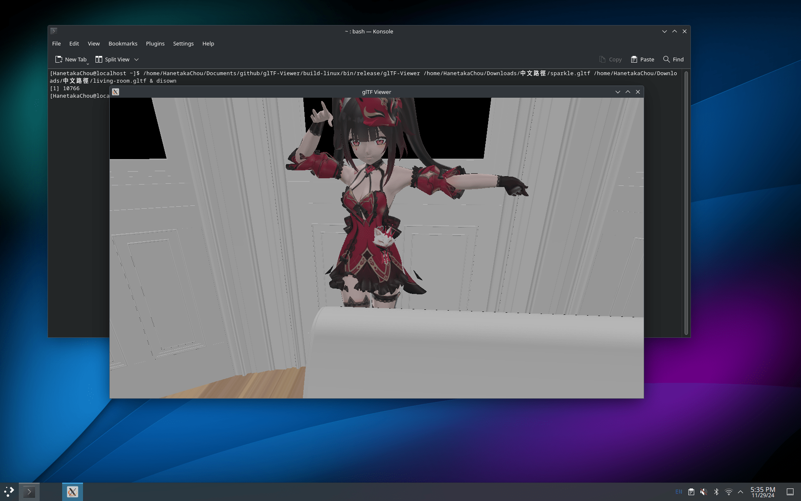
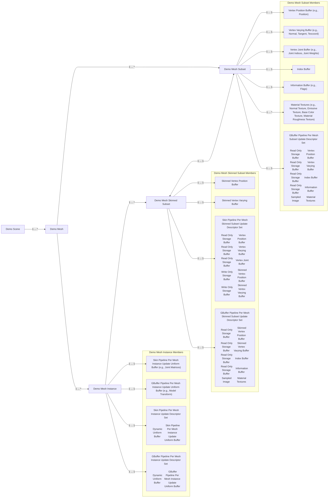
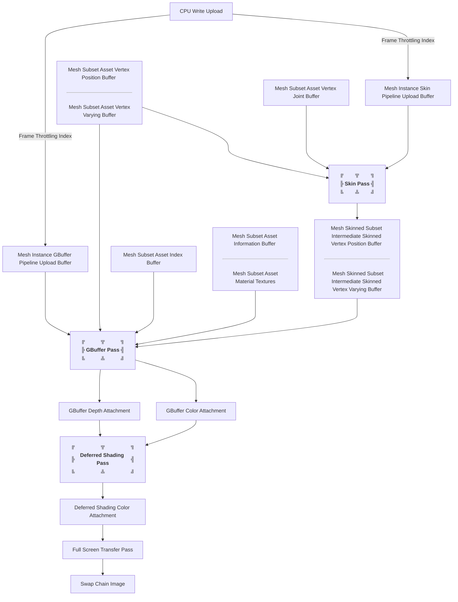

## glTF Viewer  

  

  

  

  

```mermaid
graph LR
    Demo_Scene["Demo Scene"]
    Demo_Mesh["Demo Mesh"]
    Demo_Mesh_Subset["Demo Mesh Subset"]
    Demo_Mesh_Instance["Demo Mesh Instance"]
    Demo_Mesh_Skinned_Subset["Demo Mesh Skinned Subset"]
    Vertex_Position_Buffer["Vertex Position Buffer (e.g., Position)"]
    Vertex_Varying_Buffer["Vertex Varying Buffer (e.g., Normal, Tangent, Texcoord)"]
    Vertex_Joint_Buffer["Vertex Joint Buffer (e.g., Joint Indices, Joint Weights)"]
    Index_Buffer["Index Buffer"]
    Information_Buffer["Information Buffer (e.g., Flags)"]
    Material_Textures["Material Textures (e.g., Normal Texture, Emissive Texture, Base Color Texture, Material Roughness Texture)"]
    GBuffer_Pipeline_Per_Mesh_Subset_Update_Descriptor_Set["<p> GBuffer Pipeline Per Mesh Subset Update Descriptor Set </p> <table> <tr> <td> Read Only Storage Buffer </td> <td> Vertex Position Buffer </td> </tr> <tr> <td> Read Only Storage Buffer </td> <td> Vertex Varying Buffer </td> </tr>  <tr> <td> Read Only Storage Buffer </td> <td> Index Buffer </td> </tr> <tr> <td> Read Only Storage Buffer </td> <td> Information Buffer </td> </tr> <tr> <td> Sampled Image </td> <td> Material Textures </td> </tr> </table>"]
    Skin_Pipeline_Per_Mesh_Instance_Update_Uniform_Buffer["Skin Pipeline Per Mesh Instance Update Uniform Buffer (e.g., Joint Matrices)"]
    GBuffer_Pipeline_Per_Mesh_Instance_Update_Uniform_Buffer["GBuffer Pipeline Per Mesh Instance Update Uniform Buffer (e.g., Model Transform)"]
    Skin_Pipeline_Per_Mesh_Instance_Update_Descriptor_Set["<p> Skin Pipeline Per Mesh Instance Update Descriptor Set </p> <table> <tr> <td> Dynamic Uniform Buffer </td> <td> Skin Pipeline Per Mesh Instance Update Uniform Buffer </td> </tr> </table>"]
    GBuffer_Pipeline_Per_Mesh_Instance_Update_Descriptor_Set["<p> GBuffer Pipeline Per Mesh Instance Update Descriptor Set </p> <table> <tr> <td> Dynamic Uniform Buffer </td> <td> GBuffer Pipeline Per Mesh Instance Update Uniform Buffer </td> </tr> </table>"]
    Skinned_Vertex_Position_Buffer["Skinned Vertex Position Buffer"]
    Skinned_Vertex_Varying_Buffer["Skinned Vertex Varying Buffer"]
    Skin_Pipeline_Per_Mesh_Skinned_Subset_Update_Descriptor_Set["<p> Skin Pipeline Per Mesh Skinned Subset Update Descriptor Set </p> <table> <tr> <td> Read Only Storage Buffer </td> <td> Vertex Position Buffer </td> </tr> <tr> <td> Read Only Storage Buffer </td> <td> Vertex Varying Buffer </td> </tr>  <tr> <td> Read Only Storage Buffer </td> <td> Vertex Joint Buffer </td> </tr> <tr> <td> Write Only Storage Buffer </td> <td> Skinned Vertex Position Buffer </td> </tr> <tr> <td> Write Only Storage Buffer </td> <td> Skinned Vertex Varying Buffer </td> </tr> </table>"]
    GBuffer_Pipeline_Per_Mesh_Skinned_Subset_Update_Descriptor_Set["<p> GBuffer Pipeline Per Mesh Skinned Subset Update Descriptor Set </p> <table> <tr> <td> Read Only Storage Buffer </td> <td> Skinned Vertex Position Buffer </td> </tr> <tr> <td> Read Only Storage Buffer </td> <td> Skinned Vertex Varying Buffer </td> </tr>  <tr> <td> Read Only Storage Buffer </td> <td> Index Buffer </td> </tr> <tr> <td> Read Only Storage Buffer </td> <td> Information Buffer </td> </tr> <tr> <td> Sampled Image </td> <td> Material Textures </td> </tr> </table>"]

    Demo_Scene ---> |"1 ... *"| Demo_Mesh
    Demo_Mesh ---> |"1 ... *"| Demo_Mesh_Subset
    Demo_Mesh ---> |"1 ... *"| Demo_Mesh_Instance
    Demo_Mesh_Instance ---> |"1 ... *"| Demo_Mesh_Skinned_Subset
    Demo_Mesh_Skinned_Subset <---> |"1 ... 1"| Demo_Mesh_Subset
    Demo_Mesh_Subset ---> |"1 ... 1"| Vertex_Position_Buffer
    Demo_Mesh_Subset ---> |"1 ... 1"| Vertex_Varying_Buffer
    Demo_Mesh_Subset ---> |"1 ... 1"| Vertex_Joint_Buffer
    Demo_Mesh_Subset ---> |"1 ... 1"| Index_Buffer
    Demo_Mesh_Subset ---> |"1 ... 1"| Information_Buffer
    Demo_Mesh_Subset ---> |"1 ... *"| Material_Textures
    Demo_Mesh_Subset ---> |"1 ... 1"| GBuffer_Pipeline_Per_Mesh_Subset_Update_Descriptor_Set
    Demo_Mesh_Instance ---> |"1 ... 1"| Skin_Pipeline_Per_Mesh_Instance_Update_Uniform_Buffer
    Demo_Mesh_Instance ---> |"1 ... 1"| GBuffer_Pipeline_Per_Mesh_Instance_Update_Uniform_Buffer
    Demo_Mesh_Instance ---> |"1 ... 1"| Skin_Pipeline_Per_Mesh_Instance_Update_Descriptor_Set
    Demo_Mesh_Instance ---> |"1 ... 1"| GBuffer_Pipeline_Per_Mesh_Instance_Update_Descriptor_Set
    Demo_Mesh_Skinned_Subset ---> |"1 ... 1"| Skinned_Vertex_Position_Buffer
    Demo_Mesh_Skinned_Subset ---> |"1 ... 1"| Skinned_Vertex_Varying_Buffer
    Demo_Mesh_Skinned_Subset ---> |"1 ... 1"| Skin_Pipeline_Per_Mesh_Skinned_Subset_Update_Descriptor_Set
    Demo_Mesh_Skinned_Subset ---> |"1 ... 1"| GBuffer_Pipeline_Per_Mesh_Skinned_Subset_Update_Descriptor_Set

    subgraph Demo_Mesh_Subset_Members["Demo Mesh Subset Members"]
    Vertex_Position_Buffer
    Vertex_Varying_Buffer
    Vertex_Joint_Buffer
    Index_Buffer
    Information_Buffer
    Material_Textures
    GBuffer_Pipeline_Per_Mesh_Subset_Update_Descriptor_Set
    end

    subgraph Demo_Mesh_Instance_Members["Demo Mesh Instance Members"]
    Skin_Pipeline_Per_Mesh_Instance_Update_Uniform_Buffer
    GBuffer_Pipeline_Per_Mesh_Instance_Update_Uniform_Buffer
    Skin_Pipeline_Per_Mesh_Instance_Update_Descriptor_Set
    GBuffer_Pipeline_Per_Mesh_Instance_Update_Descriptor_Set
    end

    subgraph Demo_Mesh_Skinned_Subset_Members["Demo Mesh Skinned Subset Members"]
    Skinned_Vertex_Position_Buffer
    Skinned_Vertex_Varying_Buffer
    Skin_Pipeline_Per_Mesh_Skinned_Subset_Update_Descriptor_Set
    GBuffer_Pipeline_Per_Mesh_Skinned_Subset_Update_Descriptor_Set
    end
```

```mermaid
graph TD
    CPU_Write_Upload["CPU Write Upload"]
    Mesh_Instance_Skin_Pipeline_Upload_Buffer["Mesh Instance Skin Pipeline Upload Buffer"]
    Mesh_Instance_GBuffer_Pipeline_Upload_Buffer["Mesh Instance GBuffer Pipeline Upload Buffer"]
    Mesh_Subset_Asset_Vertex_Position_Varying_Buffer["Mesh Subset Asset Vertex Position Buffer <br> <hr> <br> Mesh Subset Asset Vertex Varying Buffer"]
    Mesh_Subset_Asset_Vertex_Joint_Buffer["Mesh Subset Asset Vertex Joint Buffer"]
    Skin_Pass["<table> <tr><td>╔</td> <td>╦</td> <td>╗</td></tr> <tr><td>╠</td> <td><strong>Skin Pass</strong></td> <td>╣</td></tr> <tr> <td>╚</td> <td>╩</td> <td>╝</td></tr> </table>"]
    Mesh_Skinned_Subset_Intermediate_Skinned_Vertex_Position_Varying_Buffer["Mesh Skinned Subset Intermediate Skinned Vertex Position Buffer <br> <hr> <br>  Mesh Skinned Subset Intermediate Skinned Vertex Varying Buffer"]
    Mesh_Subset_Asset_Index_Buffer["Mesh Subset Asset Index Buffer"]
    Mesh_Subset_Asset_Geometry_Metrial_Buffer_Texture["Mesh Subset Asset Information Buffer <br> <hr> <br> Mesh Subset Asset Material Textures"]
    GBuffer_Pass["<table> <tr><td>╔</td> <td>╦</td> <td>╗</td></tr> <tr><td>╠</td> <td><strong>GBuffer Pass</strong></td> <td>╣</td></tr> <tr> <td>╚</td> <td>╩</td> <td>╝</td></tr> </table>"]
    GBuffer_Color_Attachment["GBuffer Color Attachment"]
    GBuffer_Depth_Attachment["GBuffer Depth Attachment"]
    Deferred_Shading_Pass["<table> <tr><td>╔</td> <td>╦</td> <td>╗</td></tr> <tr><td>╠</td> <td><strong>Deferred Shading Pass</strong></td> <td>╣</td></tr> <tr> <td>╚</td> <td>╩</td> <td>╝</td></tr> </table>"]
    Deferred_Shading_Color_Attachment["Deferred Shading Color Attachment" ]
    Full_Screen_Transfer_Pass["Full Screen Transfer Pass"]
    Swap_Chain_Image["Swap Chain Image"]
    
    CPU_Write_Upload --->|"Frame Throttling Index"| Mesh_Instance_Skin_Pipeline_Upload_Buffer
    CPU_Write_Upload --->|"Frame Throttling Index"| Mesh_Instance_GBuffer_Pipeline_Upload_Buffer
    Mesh_Instance_Skin_Pipeline_Upload_Buffer ---> Skin_Pass
    Mesh_Subset_Asset_Vertex_Position_Varying_Buffer ---> Skin_Pass
    Mesh_Subset_Asset_Vertex_Joint_Buffer ---> Skin_Pass
    Skin_Pass --> Mesh_Skinned_Subset_Intermediate_Skinned_Vertex_Position_Varying_Buffer
    Mesh_Instance_GBuffer_Pipeline_Upload_Buffer ---> GBuffer_Pass
    Mesh_Subset_Asset_Vertex_Position_Varying_Buffer ---> GBuffer_Pass
    Mesh_Skinned_Subset_Intermediate_Skinned_Vertex_Position_Varying_Buffer ---> GBuffer_Pass
    Mesh_Subset_Asset_Index_Buffer ---> GBuffer_Pass
    Mesh_Subset_Asset_Geometry_Metrial_Buffer_Texture ---> GBuffer_Pass
    GBuffer_Pass ---> GBuffer_Color_Attachment
    GBuffer_Pass ---> GBuffer_Depth_Attachment
    GBuffer_Color_Attachment --> Deferred_Shading_Pass
    GBuffer_Depth_Attachment --> Deferred_Shading_Pass
    Deferred_Shading_Pass --> Deferred_Shading_Color_Attachment
    Deferred_Shading_Color_Attachment --> Full_Screen_Transfer_Pass
    Full_Screen_Transfer_Pass --> Swap_Chain_Image
```
